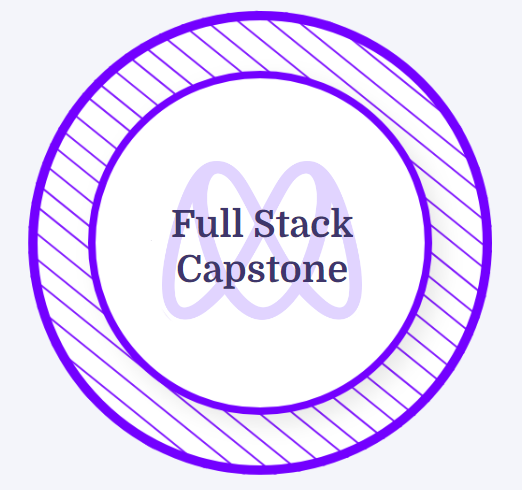

### Hi  👋 I AM BERNABAS

   
  

 

 
 
 

 

About me  
I'm Bernabas Yosef. A Full-Stack Developer. I have studied at Microverse, an online school where I code more than 8 hours a day with other developers from all around the globe.

🌱 I’m currently learning  Node.js, Frappe Framework. 

Connect with me

      
  

## Certificates & Licenses

<h3 align="left">Languages and Tools:</h3>
 

          

## Things I am passionate about

<h2 align ="left"></h2>
⚡ GitHub Stats

| | |
|:---:|:---:|
|  |  |
|  |  |  

<!--
**bernabasy/bernabasy** is a ✨ _special_ ✨ repository because its `README.md` (this file) appears on your GitHub profile.

